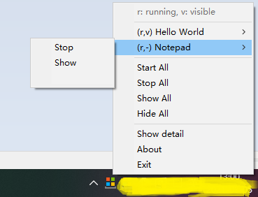

# Apps in Tray

 Start multiple applications in the system tray, and control them by one tray icon.

## Configure example

```ini
;[App Name]
; CmdLine: command line (with args) to run.
;          Can be full path or relative path to AppTray's directory.
;CmdLine=full\or\relative\path\filename.ext args
; Console: 1|0 (Optional) [default: 1]
;          Run in console (cmd.exe /c CmdLine).
;Console=1
; WorkDir: (Optional) [default: AppTray's directory]
;          Working directory for CmdLine.
;          Can be full path or relative path to AppTray's directory.
;WorkDir=work\dir\
; AutoRun: 1|0 (Optional) [default: 1]
;          Run CmdLine automatically.
;AutoRun=1
; HideWin: 1|0 (Optional) [default: 1]
;          Hide the window.
;HideWin=1

[Hello World]
CmdLine=@ECHO Hello, World!&ECHO.&ECHO Click trayicon to show menu.&ECHO.&PAUSE
Console=1
AutoRun=1
HideWin=0

[Notepad]
CmdLine=Notepad.exe
Console=0
AutoRun=1
HideWin=1
```

## Screenshots


